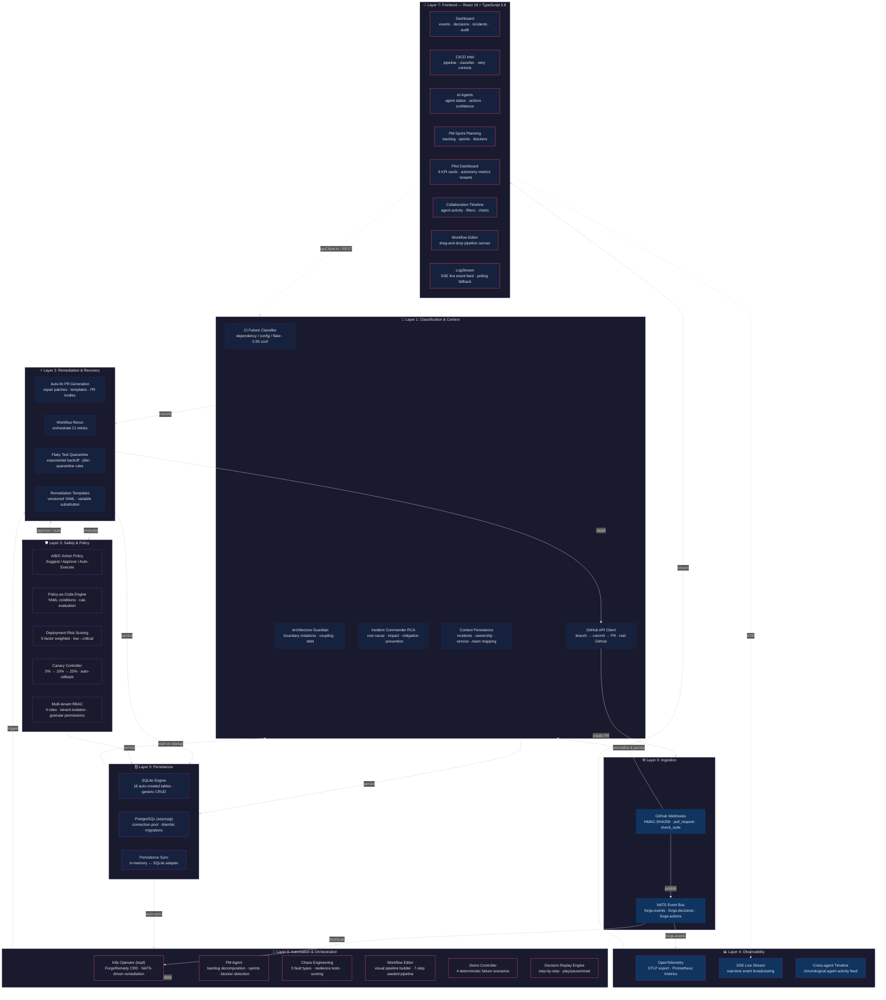

# 🔩 Forge Autonomy OS

> **AI-Native Production Operating System** — Autonomous CI/CD recovery, incident command, architecture governance, and policy-bounded release orchestration.

<p align="center">
  
  
  
  
  
  
  
  
</p>

---

## 🚀 Elevator Pitch

**Forge Autonomy OS** is an AI-native orchestration platform that autonomously manages the full software production lifecycle. When a CI pipeline fails, Forge detects it, classifies the root cause, generates an auto-fix PR, evaluates safety policies, executes a guarded canary deployment, and logs the full audit trail — all without human intervention, with safety controls at every step.

> **37 backend modules · 11 app pages · 51 REST API endpoints · 88 passing tests · 27 backlog items delivered across 7 architectural layers**

---

## 📋 Table of Contents

- [What Makes This Different?](#-what-makes-this-different)
- [System Architecture (7 Layers)](#-system-architecture-7-layers)
- [End-to-End Autonomous Flow](#-end-to-end-autonomous-flow)
- [Component Catalog](#-component-catalog)
- [Tech Stack](#-tech-stack)
- [Project Structure](#-project-structure)
- [Quick Start](#-quick-start)
- [Run the Full Demo](#-run-the-full-demo)
- [Testing & Verification](#-testing--verification)
- [Safety Architecture](#-safety-architecture)
- [Kubernetes Deployment](#-kubernetes-deployment)

---

## 💡 What Makes This Different?

| This                                                                                      | vs  | Copilot / AI Coding Assistants            |
| ----------------------------------------------------------------------------------------- | --- | ----------------------------------------- |
| **Coordinates** the full production lifecycle (CI → classify → fix → deploy → audit)      | vs  | Generate code in an editor                |
| **Autonomous decisions** with policy-bounded safety gates                                 | vs  | Suggest completions for manual acceptance |
| **End-to-end remediations** — creates branches, commits patches, opens PRs, runs canaries | vs  | Inline code changes only                  |
| **Full accountability** — every action logged with trace_id, confidence, risk, evidence   | vs  | No audit trail                            |
| **Multi-agent coordination** — SRE Agent, DevOps Agent, Architecture Guardian, PM Agent   | vs  | Single-agent chat                         |
| **Chaos engineering** — injects faults, runs resilience tests, measures recovery          | vs  | No operational testing                    |
| **K8s-native** — CRD-driven operator for auto-remediation at cluster level                | vs  | Not infrastructure-aware                  |

---

## 🏗️ System Architecture (7 Layers)



---

## 🔄 End-to-End Autonomous Flow

```mermaid
flowchart LR
    A["1. Webhook<br/>CI Failure"] -->|"check_suite: failure"| B["2. Classify<br/>dependency/config/flake"]
    B -->|"confidence ≥ 0.70"| C["3. Risk Score<br/>5-factor weighted"]
    C -->|"risk = 35 (moderate)"| D["4. Policy Gate<br/>A/B/C evaluation"]
    D -->|"Class C: auto-execute"| E["5. Generate Fix<br/>patch + PR"]
    E -->|"PR #42 opened"| F["6. Canary Deploy<br/>5% → 10% → 25%"]
    F -->|"burn rate < 2.0"| G["7. Audit & Learn<br/>full traceability"]
    G -->|"trace stored"| H["8. Close Loop<br/>RCA + metrics"]

    style A fill:#0f3460,stroke:#16213e,color:#fff
    style B fill:#16213e,stroke:#0f3460,color:#fff
    style C fill:#1a1a2e,stroke:#533483,color:#fff
    style D fill:#1a1a2e,stroke:#e94560,color:#fff
    style E fill:#16213e,stroke:#0f3460,color:#fff
    style F fill:#0f3460,stroke:#16213e,color:#fff
    style G fill:#16213e,stroke:#533483,color:#fff
    style H fill:#1a1a2e,stroke:#e94560,color:#fff
```



**The complete loop runs in under 30 seconds** — from webhook reception through classification, risk scoring, policy evaluation, repair generation, and audit trail creation. A real GitHub PR can be opened in seconds when `GITHUB_TOKEN` is configured.

---

## 📦 Component Catalog

### 🌐 Layer 0: Ingestion (2 modules)

| Component           | File           | Description                                                                                | Tests       |
| ------------------- | -------------- | ------------------------------------------------------------------------------------------ | ----------- |
| **GitHub Webhooks** | `webhooks.py`  | HMAC-SHA256 verified ingestion for `pull_request`, `check_suite`, `workflow_run` events    | ✅          |
| **NATS Event Bus**  | `event_bus.py` | Async pub/sub with JSON envelope; 5 built-in subjects; connect/publish/subscribe lifecycle | ✅ 15 tests |

### 🧠 Layer 1: Classification & Context (5 modules)

| Component                  | File                  | Description                                                                                        | Tests |
| -------------------------- | --------------------- | -------------------------------------------------------------------------------------------------- | ----- |
| **CI Failure Classifier**  | `classifier.py`       | 3-class: `dependency`, `config`, `flake` with regex pattern matching and confidence scoring        | ✅    |
| **GitHub API Client**      | `github_client.py`    | Real branch creation, file commit, PR creation via GitHub REST API (Contents + Pulls endpoints)    | ✅    |
| **Architecture Guardian**  | `guardian.py`         | Boundary violations, coupling issues, tech debt detection; service dependency graph; health scores | ✅    |
| **Incident Commander RCA** | `incident_summary.py` | Root cause analysis from timeline evidence; confidence scoring with uncertainty tracking           | ✅    |
| **Context Persistence**    | `context.py`          | Incidents CRUD + ownership mapping (service→team→slack_channel)                                    | ✅    |

### ⚡ Layer 2: Remediation & Recovery (4 modules)

| Component                  | File              | Description                                                                                                       | Tests |
| -------------------------- | ----------------- | ----------------------------------------------------------------------------------------------------------------- | ----- |
| **Auto-fix PR Generation** | `repair.py`       | Template-based fix patches for dependency/config/flake failures; full PR body generation                          | ✅    |
| **Workflow Rerun**         | `orchestrator.py` | CI workflow re-triggering with optional config per branch                                                         | ✅    |
| **Flaky Test Quarantine**  | `quarantine.py`   | Exponential backoff with jitter (Fn `0.5 * 2^n + random(0, jitter)`); quarantine rules CRUD; test status tracking | ✅    |
| **Remediation Templates**  | `templates.py`    | 6 versioned YAML templates (npm, pip, config, flake, yaml, dockerfile); variable substitution; YAML validation    | ✅    |

### 🛡️ Layer 3: Safety & Policy (5 modules)

| Component                   | File               | Description                                                                                                             | Tests |
| --------------------------- | ------------------ | ----------------------------------------------------------------------------------------------------------------------- | ----- |
| **A/B/C Action Policy**     | `policy.py`        | 3-tier: Class A (suggest, risk≥70), Class B (approve, risk≥40), Class C (auto, risk<20)                                 | ✅    |
| **Policy-as-Code Engine**   | `policy_engine.py` | YAML-defined policies; condition-based rule evaluation; 2 seeded policies (production-safety, payment-services)         | ✅    |
| **Deployment Risk Scoring** | `risk.py`          | 5-factor weighted model: files (30%), criticality (25%), config (20%), DB migration (15%), frequency (10%)              | ✅    |
| **Canary Controller**       | `canary.py`        | 3-stage progression (5%→10%→25%); configurable bake times; auto-rollback on burn rate > 2.0                             | ✅    |
| **Multi-tenant RBAC**       | `rbac.py`          | 4 roles (admin, operator, engineer, viewer); 3 tenants; permission granularity `action:*`, `deploy:*`, `incidents:view` | ✅    |

### 📊 Layer 4: Observability (3 modules)

| Component                | File           | Description                                                                                                                | Tests |
| ------------------------ | -------------- | -------------------------------------------------------------------------------------------------------------------------- | ----- |
| **OpenTelemetry**        | `telemetry.py` | OTLP gRPC exporter; console fallback; FastAPI middleware; Prometheus `/metrics` (request count, error count, avg duration) | ✅    |
| **SSE Live Stream**      | `stream.py`    | Real-time EventSource broadcasting; ambient events for UI liveliness; client tracking with graceful disconnect             | ✅    |
| **Cross-agent Timeline** | `timeline.py`  | Unified chronological feed across all agents; agent filter; decision stats                                                 | ✅    |

### 🗄️ Layer 5: Persistence (3 modules)

| Component                | File                  | Description                                                                                                                | Tests |
| ------------------------ | --------------------- | -------------------------------------------------------------------------------------------------------------------------- | ----- |
| **SQLite Engine**        | `persistence.py`      | 18 auto-created tables; generic CRUD helper; store-specific helpers; API router with stats/reset                           | ✅    |
| **PostgreSQL (asyncpg)** | `pg_persistence.py`   | asyncpg connection pool (min=2, max=10); SQLAlchemy metadata for all 18 entities; Alembic migrations; auto-schema creation | ✅    |
| **Persistence Sync**     | `persistence_sync.py` | 14 sync functions bridging in-memory ↔ SQLite; startup load; silent fallback                                               | ✅    |

### 🤖 Layer 6: Automation & Orchestration (6 modules)

| Component                  | File           | Description                                                                                                                     | Tests       |
| -------------------------- | -------------- | ------------------------------------------------------------------------------------------------------------------------------- | ----------- |
| **K8s Operator**           | `operator.py`  | kopf-based with ForgeRemedy CRD; NATS-driven remediation dispatcher; standalone dev mode                                        | ✅          |
| **PM Agent**               | `pm_agent.py`  | Backlog decomposition from NL descriptions; sprint plan generation with velocity factor; blocker detection from CI/CD telemetry | ✅          |
| **Chaos Engineering**      | `chaos.py`     | 5 fault types (latency, error, dependency_failure, resource_exhaustion, network_partition); resilience test CRUD + execution    | ✅ 17 tests |
| **Workflow Editor**        | `workflows.py` | Backend CRUD + 7-step seeded CI/CD pipeline with execute endpoint                                                               | ✅          |
| **Demo Controller**        | `demo.py`      | 4 deterministic failure scenarios (dependency, config, flake, latency); live + replay modes                                     | ✅          |
| **Decision Replay Engine** | `replay.py`    | Step-by-step replay sessions with play/pause/reset; timeline evidence per step                                                  | ✅          |

### 🎨 Layer 7: Frontend (12 pages — including app shell + public routes)

| Page                       | File                        | Description                                                                                          |
| -------------------------- | --------------------------- | ---------------------------------------------------------------------------------------------------- |
| **Dashboard**              | `Dashboard.tsx`             | Events feed, decisions log, incident display, audit trail, canary status, policy stats               |
| **CI/CD Intel**            | `CICD.tsx`                  | Pipeline visualization, classifier integration, failure injection, repair generation, retry controls |
| **AI Agents**              | `Agents.tsx`                | Agent cards (SRE, DevOps, Guardian), confidence scores, action history, replay engine                |
| **Architecture**           | `Architecture.tsx`          | Guardian service graph with D3 visualization, health scores, findings with severity colors           |
| **Incidents**              | `Incidents.tsx`             | Incident list with severity colors, RCA summary panel, timeline evidence                             |
| **Analytics**              | `Analytics.tsx`             | Classifier analysis, policy evaluation statistics, decision distribution charts                      |
| **Workflows**              | `Workflows.tsx`             | Drag-and-drop visual pipeline canvas, node properties, execute controls                              |
| **PM Sprint Planning**     | `SprintPlanning.tsx`        | 3-tab layout: Backlog / Sprints / Blockers; AI decomposition; sprint plan generator                  |
| **Pilot Dashboard**        | `PilotDashboard.tsx`        | 6 KPI cards (uptime, MTTR, MTTD, CFR, deploys/day, coverage), service health, autonomy metrics       |
| **Collaboration Timeline** | `CollaborationTimeline.tsx` | Chronological agent activity feed, agent filter chips, decision distribution bar chart               |
| **Policy Management**      | `PolicyManagement.tsx`      | Policy CRUD, rule editor, evaluate panel with risk context input                                     |
| **Onboarding**             | `Onboarding.tsx`            | Tenant readiness checklist, setup progress tracking                                                  |

---

## 🔧 Tech Stack

### Backend — Python 3.13 (37 modules)

| Category          | Technologies                                            |
| ----------------- | ------------------------------------------------------- |
| **Framework**     | FastAPI 1.0, Uvicorn 0.34, Pydantic v2                  |
| **Databases**     | asyncpg (PostgreSQL 17), SQLite 3, Alembic 1.14         |
| **Observability** | OpenTelemetry SDK, OTLP gRPC, Prometheus metrics        |
| **Messaging**     | NATS (nats-py 2.6), SSE streaming                       |
| **Kubernetes**    | kopf 1.37 (K8s operator framework)                      |
| **Testing**       | pytest 8.3, httpx 0.28 (TestClient)                     |
| **API**           | 51 REST endpoints · 15 domains · 30+ API client methods |

### Frontend — React 18 + TypeScript 5.8 (21 pages + 38 UI components)

| Category      | Technologies                                                        |
| ------------- | ------------------------------------------------------------------- |
| **Framework** | React 18, TypeScript 5.8, Vite 5                                    |
| **Routing**   | React Router 6 (19 routes + 404 catch-all)                          |
| **State**     | TanStack Query 5, React Hook Form 7 + Zod                           |
| **Styling**   | Tailwind CSS 3.4, shadcn/ui (38 Radix primitives), Framer Motion 12 |
| **Charts**    | Recharts 2.15, D3 visualization                                     |
| **Testing**   | Vitest 3, React Testing Library, jsdom                              |
| **Build**     | Vite 5 production bundle (2939 modules, 1.9 MB JS)                  |

### Infrastructure

| Component            | Technology                                                                          |
| -------------------- | ----------------------------------------------------------------------------------- |
| **Containerization** | Docker + docker-compose (3 services)                                                |
| **K8s Deployment**   | 7 manifests (CRD, operator, backend, frontend, NATS, OTEL collector, kustomization) |
| **Database**         | PostgreSQL 17 (Alpine), persistent volume, health checks                            |
| **CI/CD**            | GitHub Actions (backend + frontend pipeline)                                        |

---

## 📂 Project Structure

```
├── backend/
│   ├── app/
│   │   ├── main.py                 # App bootstrap + 12 routers
│   │   ├── api.py                  # Events/Decisions/Audit CRUD (5 endpoints)
│   │   ├── schemas.py             # Pydantic models (Event, Decision, Audit, Risk, etc.)
│   │   ├── classifier.py          # 3-class CI failure classifier
│   │   ├── repair.py              # Auto-fix PR patch generation
│   │   ├── webhooks.py            # GitHub webhook ingestion (HMAC-SHA256)
│   │   ├── orchestrator.py        # Workflow rerun orchestration
│   │   ├── canary.py              # Canary controller (3-stage, auto-rollback)
│   │   ├── risk.py                # 5-factor deployment risk scoring
│   │   ├── policy.py              # A/B/C action class policy
│   │   ├── policy_engine.py       # YAML policy-as-code engine
│   │   ├── guardian.py            # Architecture guardian (boundary, coupling, debt)
│   │   ├── incident_summary.py    # Incident commander RCA
│   │   ├── context.py             # Incidents + ownership persistence
│   │   ├── pm_agent.py            # PM agent (backlog, sprints, blockers)
│   │   ├── timeline.py            # Cross-agent collaboration timeline
│   │   ├── onboarding.py          # Pilot dashboard KPIs + tenant onboarding
│   │   ├── chaos.py               # Chaos engineering (5 fault types)
│   │   ├── quarantine.py          # Flaky test quarantine + retry backoff
│   │   ├── templates.py           # YAML remediation templates
│   │   ├── workflows.py           # Visual workflow editor backend
│   │   ├── rbac.py                # Multi-tenant RBAC (4 roles)
│   │   ├── demo.py                # Demo failure injection (4 scenarios)
│   │   ├── replay.py              # Decision replay engine
│   │   ├── stream.py              # SSE live event stream
│   │   ├── telemetry.py           # OpenTelemetry instrumentation
│   │   ├── event_bus.py           # NATS pub/sub abstraction
│   │   ├── operator.py            # K8s operator (kopf)
│   │   ├── github_client.py       # GitHub API client (real PRs)
│   │   ├── persistence.py         # SQLite engine (18 tables)
│   │   ├── persistence_sync.py    # In-memory ↔ SQLite sync adapter
│   │   ├── pg_persistence.py      # PostgreSQL (asyncpg, async CRUD)
│   │   ├── run_demo.py            # End-to-end demo script (--chaos flag)
│   │   ├── test_all.py            # 56 integration tests
│   │   ├── test_chaos.py          # 17 chaos engineering tests
│   │   └── test_event_bus.py      # 15 NATS event bus tests
│   ├── alembic/                   # Database migrations (PostgreSQL)
│   ├── Dockerfile                 # Multi-stage Python 3.13-slim
│   └── requirements.txt           # Python dependencies
├── src/
│   ├── App.tsx                    # Routes + providers (21 pages)
│   ├── main.tsx                   # Entry point
│   ├── pages/                     # 11 app pages + 8 public pages
│   │   ├── Dashboard.tsx          # Events, decisions, incidents, audit
│   │   ├── CICD.tsx              # CI/CD pipeline + classifier
│   │   ├── Agents.tsx            # AI agents + replay engine
│   │   ├── Architecture.tsx      # Guardian service graph
│   │   ├── Incidents.tsx         # Incident list + RCA summaries
│   │   ├── SprintPlanning.tsx    # PM agent (3-tab)
│   │   ├── PilotDashboard.tsx    # KPIs + onboarding
│   │   ├── CollaborationTimeline.tsx  # Agent activity feed
│   │   ├── PolicyManagement.tsx  # Policy CRUD + evaluation
│   │   └── Workflows.tsx         # Pipeline canvas
│   ├── components/               # 38 shadcn/ui components
│   │   ├── ui/                   # Button, card, dialog, etc.
│   │   ├── layout/               # AppShell, Sidebar, Topbar
│   │   └── LogStream.tsx         # SSE-powered live feed
│   ├── lib/
│   │   ├── apiClient.ts          # 30+ API methods with mock fallback
│   │   ├── mock.ts               # Mock seed data
│   │   └── utils.ts              # Utilities
│   └── test/                     # 15 frontend tests
├── deploy/
│   └── kubernetes/               # 7 K8s manifests
│       ├── crd.yaml              # ForgeRemedy CRD
│       ├── operator-deployment.yaml  # kopf operator
│       ├── backend-deployment.yaml
│       ├── frontend-deployment.yaml
│       ├── nats-deployment.yaml
│       ├── otel-collector.yaml
│       ├── kustomization.yaml
│       └── deploy.sh             # 7-step deployment script
├── docs/
│   ├── ARCHITECTURE.md           # Full Mermaid architecture
│   ├── IMPLEMENTATION-BACKLOG.md # 27 backlog items
│   ├── PIPELINE.md               # Production pipeline
│   ├── ROADMAP.md                # Multi-milestone roadmap
│   └── DEMO-RUNBOOK.md           # Demo runbook
├── docker-compose.yml            # PostgreSQL + backend + frontend
└── package.json
```

---

## 🚀 Quick Start

### Prerequisites

- Python 3.13+
- Node.js 18+
- npm or pnpm

### 1. Backend

```bash
cd backend
pip install -r requirements.txt
set GITHUB_WEBHOOK_SECRET=forge-dev-secret   # Windows
# export GITHUB_WEBHOOK_SECRET=forge-dev-secret  # macOS/Linux

# Start the API server
uvicorn app.main:app --port 8000 --reload
```

### 2. Frontend

```bash
npm install
npx vite --port 5173
```

### 3. Verify

```bash
# Backend health check
curl http://localhost:8000/health
# → {"status":"healthy","version":"1.0.0","service":"forge-autonomy-os"}

# Open frontend
open http://localhost:5173
```

---

## 🎬 Run the Full Demo

The demo script exercises the complete autonomous CI recovery flow:

```bash
cd backend
GITHUB_WEBHOOK_SECRET=forge-dev-secret python -m app.run_demo
```

This walks through all 7 steps:

1. ✅ **Health check** — Backend responds
2. ✅ **Webhook injection** — Simulated `check_suite` failure with HMAC-SHA256 signature
3. ✅ **CI failure classification** — Classified as `dependency` with 0.95 confidence
4. ✅ **Auto-fix generation** — 7-line patch with full PR body
5. ✅ **PR creation** — Endpoint responds (blocked gracefully when no `GITHUB_TOKEN`)
6. ✅ **OTel metrics** — Prometheus `/metrics` exposes request/error/duration counters
7. ✅ **Audit persistence** — Events, decisions, and audit trails stored

### Chaos Engineering Demo

```bash
cd backend
GITHUB_WEBHOOK_SECRET=forge-dev-secret python -m app.run_demo --chaos
```

Adds 11 additional chaos checks:

- Inject 3 fault types (latency, error, dependency_failure)
- List active faults, simulate impact, stop a fault
- List, get, run, and create resilience tests
- Get chaos engineering summary with resilience score

---

## 🧪 Testing & Verification

### Backend (88 tests — all passing)

```bash
cd backend
python -m pytest app/test_all.py app/test_chaos.py app/test_event_bus.py -v
# 88 passed in 3.9s
```

### Frontend (15 tests — all passing)

```bash
npx vitest run
# 15 passed
```

### TypeScript Compilation (0 errors)

```bash
npx tsc --noEmit
# No output = clean compile
```

### Vite Production Build

```bash
npx vite build
# 2939 modules bundled in 19.6s
# Output: dist/ (1.9 MB JS, 0 errors)
```

---

## 🛡️ Safety Architecture

Forge Autonomy OS has a **three-layer safety model** designed for enterprise production use:

### Layer 1: Action Classification

| Class                     | Policy                                 | Examples                              | Blast Radius |
| ------------------------- | -------------------------------------- | ------------------------------------- | ------------ |
| **A — Suggest Only**      | Risk ≥ 70 or org-wide impact           | Schema changes, service decomposition | High         |
| **B — Approval Required** | Risk ≥ 40 or moderate + low confidence | Config changes, canary promote        | Medium       |
| **C — Auto Execute**      | Risk < 20 + high confidence            | Logging changes, simple retries       | Low          |

### Layer 2: Risk Scoring

5 weighted factors combine into a single risk score (0-100):

- **30%** — Files changed count
- **25%** — Service criticality (critical/high/medium/low)
- **20%** — Configuration change indicator
- **15%** — Database migration indicator
- **10%** — Deployment frequency (inverse)

### Layer 3: Multi-tenant RBAC

| Role         | Permissions                       | Use Case         |
| ------------ | --------------------------------- | ---------------- |
| **Admin**    | Full CRUD on all resources        | Platform team    |
| **Operator** | Execute actions, manage incidents | SRE / DevOps     |
| **Engineer** | Create incidents, view all        | Development team |
| **Viewer**   | Read-only access                  | Stakeholders     |

**Every autonomous action is:**

1. ✅ Scored for risk and blast radius
2. ✅ Evaluated against active policies
3. ✅ Checked against role permissions
4. ✅ Logged with full audit trail (trace_id, agent, confidence, risk, evidence)
5. ✅ Replayable step-by-step

---

## ☸️ Kubernetes Deployment

Forge includes a complete K8s deployment stack with 7 manifests:

```bash
# Deploy the full stack
cd deploy/kubernetes
chmod +x deploy.sh
./deploy.sh
```

The `deploy.sh` script orchestrates:

1. **Namespace** — `forge-autonomy-os`
2. **CRD** — `ForgeRemedy` custom resource definition
3. **NATS** — StatefulSet with JetStream, headless service
4. **OTEL Collector** — OpenTelemetry collector with Prometheus exporter
5. **Backend** — FastAPI deployment with secret references
6. **Frontend** — Nginx-served React SPA
7. **Operator** — kopf-based operator with ClusterRole RBAC

### ForgeRemedy CRD Example

```yaml
apiVersion: forge.os/v1
kind: ForgeRemedy
metadata:
  name: dependency-fix-db-pool
spec:
  service: db-pool-service
  fixType: dependency
  patch: |
    {
      "dependencies": {
        "some-package": "^1.2.0"
      }
    }
  version: 1.0.0
  replicas: 3
  traceId: "trace-abc123"
  priority: high
```

---

## 📖 Documentation

| Document                                                          | Description                                                   |
| ----------------------------------------------------------------- | ------------------------------------------------------------- |
| **[ARCHITECTURE.md](./docs/ARCHITECTURE.md)**                     | Full 7-layer Mermaid diagram with component IDs and data flow |
| **[PIPELINE.md](./docs/PIPELINE.md)**                             | AI-native production pipeline — 8-step control loop           |
| **[ROADMAP.md](./docs/ROADMAP.md)**                               | 6-milestone delivery roadmap with exit criteria               |
| **[IMPLEMENTATION-BACKLOG.md](./docs/IMPLEMENTATION-BACKLOG.md)** | All 27 backlog items with detailed acceptance criteria        |
| **[DEMO-RUNBOOK.md](./docs/DEMO-RUNBOOK.md)**                     | Complete 10-minute demo flow for investors/judges             |

---

## 📊 Key Metrics

| Metric               | Value                                                                          |
| -------------------- | ------------------------------------------------------------------------------ |
| Backend modules      | 37 Python modules                                                              |
| Frontend pages       | 11 app pages + 8 public pages + NotFound                                       |
| REST API endpoints   | 51 across 15 domains                                                           |
| Backend tests        | 88 (all passing)                                                               |
| Frontend tests       | 15 (all passing)                                                               |
| shadcn/ui components | 38 Radix primitives                                                            |
| NPM dependencies     | ~50 packages                                                                   |
| Python dependencies  | ~15 packages                                                                   |
| Vite build           | 2,939 modules, 1.9 MB                                                          |
| TypeScript errors    | 0                                                                              |
| Backlog items        | 27 delivered                                                                   |
| Architecture layers  | 7 layers                                                                       |
| K8s manifests        | 7 files                                                                        |
| DB tables (SQLite)   | 18 auto-created                                                                |
| DB migration (PG)    | Alembic with 1 migration                                                       |
| CI failure classes   | 3 (dependency, config, flake)                                                  |
| Fault types (chaos)  | 5 (latency, error, dependency_failure, resource_exhaustion, network_partition) |
| RBAC roles           | 4 (admin, operator, engineer, viewer)                                          |
| Canary stages        | 3 (5% → 10% → 25%)                                                             |
| Demo scenarios       | 4 deterministic failures                                                       |

---

## 📄 License

MIT

---

<p align="center">
  <i>Built with FastAPI · React · TypeScript · PostgreSQL · NATS · kopf · OpenTelemetry</i>
</p>
