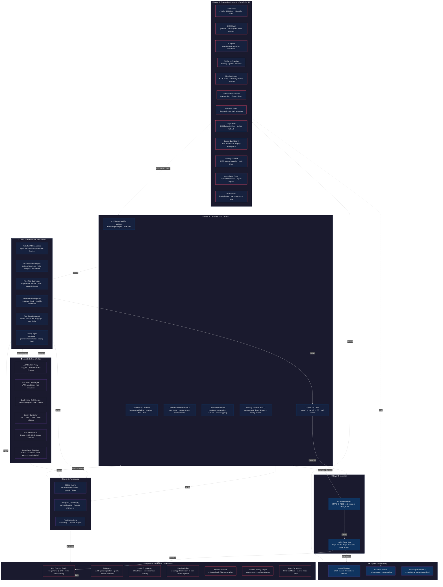

# Forge Autonomy OS — System Architecture

> **43 modules** across 7 layers, delivering end-to-end autonomous production orchestration.
> 121 backend tests · 15 frontend tests · 25 frontend pages · 100+ REST API endpoints

---

---

## Layer Descriptions

### 🌐 Layer 0: Ingestion (2 modules)

| Component | File | Description |
|-----------|------|-------------|
| GitHub Webhooks | `webhooks.py` | HMAC-SHA256 verified ingestion for `pull_request`, `check_suite`, `workflow_run` events |
| NATS Event Bus | `event_bus.py` | Async pub/sub with JSON envelope; 5 built-in subjects (forge.events, forge.decisions, forge.incidents, forge.actions, forge.webhooks) |

### 🧠 Layer 1: Classification & Context (6 modules)

| Component | File | Description |
|-----------|------|-------------|
| CI Failure Classifier | `classifier.py` | 4-class: dependency, config, flake, performance_regression with regex pattern matching & confidence scoring |
| GitHub API Client | `github_client.py` | Real branch creation, file commit, PR creation via GitHub REST API (Contents + Pulls endpoints) |
| Architecture Guardian | `guardian.py` | Boundary violations, coupling, tech debt, **config drift detection**; service dependency graph; health scores |
| Incident Commander RCA | `incident_summary.py` | Root cause analysis + **cross-service cascading failure chains**; blast radius; dependency maps |
| Context Persistence | `context.py` | Incidents CRUD + ownership mapping (service→team→slack_channel) |
| Security Scanner | `security_scanner.py` | SAST: 12 secret patterns, 11 insecure configs, 3 vulnerable deps; CVSS scoring; 3 API endpoints |

### ⚡ Layer 2: Remediation & Recovery (6 modules)

| Component | File | Description |
|-----------|------|-------------|
| Auto-fix PR Generation | `repair.py` | Template-based fix patches for dependency/config/flake failures; full PR body generation |
| Workflow Rerun Agent | `rerun_agent.py` | Autonomous CI rerun decisions; flaky test analysis; exponential backoff with auto-escalation; 8 API endpoints |
| Flaky Test Quarantine | `quarantine.py` | Exponential backoff with jitter (`0.5 * 2^n + random(0, jitter)`); quarantine rules CRUD; test status tracking |
| Remediation Templates | `templates.py` | 6 versioned YAML templates (npm, pip, config, flake, yaml, dockerfile); variable substitution; YAML validation |
| Test Selection Agent | `test_selection.py` | Impact-based test selection; 21 file-to-test mappings; module dep chain impact; commit message analysis |
| Canary Agent | `canary_agent.py` | Autonomous canary monitoring; health eval (error rate, p99, burn rate, traffic); promote/hold/rollback decisions; deploy intel |

### 🛡️ Layer 3: Safety & Policy (6 modules)

| Component | File | Description |
|-----------|------|-------------|
| A/B/C Action Policy | `policy.py` | 3-tier: Class A (suggest, risk≥70), Class B (approve, risk≥40), Class C (auto, risk<20) |
| Policy-as-Code Engine | `policy_engine.py` | YAML-defined policies; condition-based rule evaluation; 2 seeded policies (production-safety, payment-services) |
| Deployment Risk Scoring | `risk.py` | 5-factor weighted model: files (30%), criticality (25%), config (20%), DB migration (15%), frequency (10%) |
| Canary Controller | `canary.py` | 3-stage progression (5%→10%→25%); configurable bake times; auto-rollback on burn rate > 2.0 |
| Multi-tenant RBAC + SSO | `rbac.py` + `sso.py` | 4 roles (admin, operator, engineer, viewer); OIDC/OAuth2 SSO (Google, GitHub, Azure AD, custom); SAML config; session management |
| Compliance Reporting | `compliance.py` | 14 SOC2 + 7 ISO27001 controls; report generation; multi-format export (JSON, CSV, markdown); audit stats |

### 📊 Layer 4: Observability (3 modules)

| Component | File | Description |
|-----------|------|-------------|
| OpenTelemetry | `telemetry.py` | OTLP gRPC exporter; console fallback; FastAPI middleware; Prometheus `/metrics` (request count, error count, avg duration) |
| SSE Live Stream | `stream.py` | Real-time EventSource broadcasting; ambient events for UI liveliness; client tracking with graceful disconnect |
| Cross-agent Timeline | `timeline.py` | Unified chronological feed across all agents; agent filter; decision stats |

### 🗄️ Layer 5: Persistence (3 modules)

| Component | File | Description |
|-----------|------|-------------|
| SQLite Engine | `persistence.py` | 18 auto-created tables; generic CRUD helper; store-specific helpers; API router with stats/reset |
| PostgreSQL (asyncpg) | `pg_persistence.py` | asyncpg connection pool (min=2, max=10); SQLAlchemy metadata for all 18 entities; Alembic migrations; auto-schema creation |
| Persistence Sync | `persistence_sync.py` | 14 sync functions bridging in-memory ↔ SQLite; startup load; silent fallback |

### 🤖 Layer 6: Automation & Orchestration (7 modules)

| Component | File | Description |
|-----------|------|-------------|
| K8s Operator | `operator.py` | kopf-based with ForgeRemedy CRD; NATS-driven remediation dispatcher; multi-cluster deployment (staging-us, prod-us, prod-eu) |
| PM Agent | `pm_agent.py` | Backlog decomposition from NL descriptions; sprint plan generation with velocity factor; blocker detection from CI/CD telemetry |
| Chaos Engineering | `chaos.py` | 5 fault types (latency, error, dependency_failure, resource_exhaustion, network_partition); resilience test CRUD + execution |
| Workflow Editor | `workflows.py` | Backend CRUD + 7-step seeded CI/CD pipeline with execute endpoint |
| Agent Orchestrator | `orchestrator_agent.py` | DAG-based workflow orchestration; 3 predefined workflows; dep graph resolution; parallel step execution; exponential retry |
| Demo Controller | `demo.py` | 4 deterministic failure scenarios (dependency, config, flake, latency); live + replay modes |
| Decision Replay Engine | `replay.py` | Step-by-step replay sessions with play/pause/reset; timeline evidence per step |

### 🎨 Layer 7: Frontend (25 pages — including app shell + public routes)

| Page | File | Description |
|------|------|-------------|
| Dashboard | `Dashboard.tsx` | Events feed, decisions log, incident display, audit trail, canary status, policy stats |
| CI/CD Intel | `CICD.tsx` | Pipeline visualization, classifier integration, rerun agent panel, failure patterns, workflow history |
| AI Agents | `Agents.tsx` | Agent cards (SRE, DevOps, Guardian), confidence scores, action history, replay engine |
| Architecture | `Architecture.tsx` | Guardian service graph, service comparison grid, layered findings, check timeline, discovery wizard |
| Incidents | `Incidents.tsx` | Incident list, RCA summary, cross-service cascading failure chains, dependency maps |
| Analytics | `Analytics.tsx` | Classifier analysis, policy evaluation statistics, decision distribution charts |
| Workflows | `Workflows.tsx` | Drag-and-drop visual pipeline canvas, node properties, execute controls |
| PM Sprint Planning | `SprintPlanning.tsx` | 3-tab layout: Backlog / Sprints / Blockers; AI decomposition; sprint plan generator |
| Pilot Dashboard | `PilotDashboard.tsx` | 6 KPI cards (uptime, MTTR, MTTD, CFR, deploys/day, coverage), service health, autonomy metrics |
| Collaboration Timeline | `CollaborationTimeline.tsx` | Chronological agent activity feed, agent filter chips, decision distribution bar chart |
| Policy Management | `PolicyManagement.tsx` | Policy CRUD, rule editor, evaluate panel with risk context input |
| Canary Dashboard | `CanaryDashboard.tsx` | Auto-rollback UI, live canary monitoring, deploy intelligence, scenario simulator |
| Security Scanner | `Security.tsx` | SAST scan input, result severity display, rule browser |
| Compliance Portal | `Compliance.tsx` | SOC2/ISO27001 control mapping, report generation, JSON/CSV/markdown export buttons |
| Agent Orchestrator | `Orchestrator.tsx` | DAG workflow selection, step execution visualization, execution logs |
| *Public pages* | `Index.tsx`, `About.tsx`, `Features.tsx`, `Pricing.tsx`, `Contact.tsx`, `Login.tsx`, `Register.tsx`, `Onboarding.tsx` | Marketing + auth pages |
| *App shell* | `AppLayout.tsx`, `AppSidebar.tsx`, `Topbar.tsx`, `AuthShell.tsx` | Layout components |

---

## Data Flow

1. **Ingestion** — GitHub Webhooks receive CI failure events, normalize to EventSchema, publish to NATS
2. **Classification** — Classifier identifies failure type (dependency/config/flake/performance), Guardian checks architecture, Security Scanner validates code
3. **Remediation** — Repair generator creates fix patches, Test Selector picks relevant tests, Canary Agent evaluates deployment health
4. **Safety Gate** — Risk scorer weights 5 factors, Policy Engine evaluates against YAML rules, RBAC checks permissions
5. **Execution** — Auto-fix PR created, canary rollout proceeds (5%→10%→25%), workflow rerun triggered
6. **Observability** — Every action traced via OpenTelemetry, streamed via SSE, recorded in timeline
7. **Persistence** — Events, decisions, audits stored in SQLite/PostgreSQL, synced on startup
8. **Orchestration** — Agent Orchestrator coordinates DAG workflows, K8s operator handles cluster-level remediation

---

  <i>Forge Autonomy OS — AI-Native Production Operating System</i>

