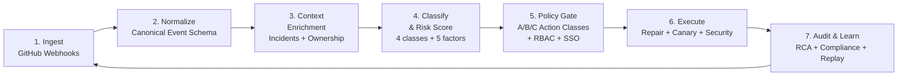

# Forge Autonomy OS — AI-Native Production Pipeline

> **Version:** 1.0.0 | **Status:** ✅ All 7 pipeline stages implemented, all quality gates operational
> **43 backend modules · 25 frontend pages · 121 backend tests · 15 frontend tests · 100+ API endpoints**

---

## 1) Objective

Build a unified autonomous production control loop that ingests engineering signals, reasons over context, executes safe actions, and continuously learns.

**Current capability:** Complete control loop implemented for the full software production lifecycle — from webhook ingestion → classification → repair → policy gate → canary deployment → security validation → compliance audit.

---

## 2) End-to-End Control Loop



### Implementation Status

| Step | Status | Module(s) |
|------|--------|-----------|
| 1. Ingest | ✅ GitHub webhooks (HMAC-SHA256) + NATS event bus | `webhooks.py`, `event_bus.py` |
| 2. Normalize | ✅ Pydantic EventSchema | `schemas.py`, `api.py` |
| 3. Context Enrichment | ✅ Incidents + ownership lookup + security scanning | `context.py`, `security_scanner.py` |
| 4. Classify + Risk Score | ✅ 4-class classifier + 5-factor risk + performance regression + config drift | `classifier.py`, `risk.py`, `guardian.py` |
| 5. Policy Gate | ✅ A/B/C actions + YAML policies + RBAC + SSO OIDC | `policy.py`, `policy_engine.py`, `rbac.py`, `sso.py` |
| 6. Execute | ✅ Auto-fix PR, workflow rerun, canary, test selection, agent orchestration | `repair.py`, `rerun_agent.py`, `canary.py`, `canary_agent.py`, `test_selection.py`, `orchestrator_agent.py` |
| 7. Audit & Learn | ✅ RCA + compliance reporting + replay engine + cross-service chains | `incident_summary.py`, `compliance.py`, `replay.py` |

---

## 3) System Architecture

### Current (v1.0.0 — Production)

```
┌────────────────────────────────────────────────────────────────────────┐
│                        FastAPI Application                              │
├────────────────────────────────────────────────────────────────────────┤
│  Layer 0 — Ingestion:  GitHub Webhooks ──→ NATS Event Bus              │
│  Layer 1 — Context:    Classifier · Guardian · RCA · Security Scanner   │
│  Layer 2 — Recovery:   Repair · Rerun Agent · Canary Agent · Templates │
│  Layer 3 — Safety:     Risk · Policy · RBAC · SSO · Compliance         │
│  Layer 4 — Observability: OpenTelemetry · SSE · Timeline                │
│  Layer 5 — Storage:    SQLite · PostgreSQL (asyncpg) · Alembic          │
│  Layer 6 — Orchestration: K8s Operator · PM Agent · Chaos · Workflows  │
│  Layer 7 — Frontend:   React 18 + TypeScript 5.8 + 25 pages            │
└────────────────────────────────────────────────────────────────────────┘
```

### Infrastructure

| Component | Implementation | Status |
|-----------|---------------|--------|
| Event Bus | NATS (nats-py 2.6) — 5 subjects: forge.events, forge.decisions, forge.incidents, forge.actions, forge.webhooks | ✅ Production |
| Database (primary) | PostgreSQL 17 via asyncpg — connection pool (min=2, max=10), SQLAlchemy metadata | ✅ Production |
| Database (embedded) | SQLite — 18 auto-created tables, generic CRUD, fallback mode | ✅ Production |
| Database migrations | Alembic with auto-schema creation | ✅ Production |
| K8s Integration | kopf operator with ForgeRemedy CRD, 9 K8s manifests, multi-cluster | ✅ Production |
| GitHub Integration | Real branch creation, file commit, PR opening via GitHub REST API | ✅ Production |
| Observability | OpenTelemetry OTLP exporter, Prometheus `/metrics`, console fallback | ✅ Production |
| Real-time Events | SSE live stream with EventSource, polling fallback, ambient events | ✅ Production |
| Containerization | Multi-stage Dockerfiles (Python 3.13-slim, Node 20 → Nginx) + docker-compose | ✅ Production |
| CI/CD | GitHub Actions — backend tests (121), frontend tests (15), typecheck, build | ✅ Production |

---

## 4) Action Classes and Safety

### Three-Class Framework

| Class | Description | Examples | Status |
|-------|-------------|----------|--------|
| **A — Suggest Only** | Architecture-level, high-blast-radius | Schema changes, service decomposition | ✅ Policy enforcement |
| **B — Approval Required** | Non-trivial config/deploy updates | Config changes, canary promote | ✅ Policy enforcement |
| **C — Auto Execute** | Bounded, reversible, low-blast | Logging changes, simple retries | ✅ Policy enforcement |

### Mandatory Controls

- ✅ Idempotency key per action (trace_id based)
- ✅ Full audit trail (input, evidence, decision, output)
- ✅ Rollback plan required for every production mutation (auto-rollback in canary)
- ✅ Confidence and blast-radius thresholds before auto-action
- ✅ RBAC permission checks (admin/operator/engineer/viewer)
- ✅ SSO OIDC authentication (Google, GitHub, Azure AD, custom)
- ✅ SAST security scanning (secrets, insecure configs, vulnerable deps)
- ✅ SOC2 + ISO27001 compliance reporting with multi-format export

---

## 5) AI-Native Quality Gates

| Gate | Status | Module | Description |
|------|--------|--------|-------------|
| 1. Impact-based test selection | ✅ Complete | `test_selection.py` | 21 file-to-test mappings, module dep chain, commit analysis |
| 2. Deployment risk scoring | ✅ Complete | `risk.py` | 5-factor weighted model (files/criticality/config/DB/frequency) |
| 3. Security validation (SAST/secrets/deps) | ✅ Complete | `security_scanner.py` | 12 secrets, 11 configs, 3 deps with CVSS scoring |
| 4. Performance regression detection | ✅ Complete | `classifier.py` | 4th class with 18 regex patterns (benchmark/load/latency/memory) |
| 5. Configuration drift detection | ✅ Complete | `guardian.py` | Baselines for 5 services, drift types + severity scoring |
| 6. Post-deploy anomaly/burn-rate gate | ✅ Complete | `canary.py`, `canary_agent.py` | 3-stage canary, burn rate > 2.0 triggers auto-rollback |
| 7. Enterprise SSO + RBAC | ✅ Complete | `sso.py`, `rbac.py` | Multi-provider OIDC/OAuth2, SAML, 4 roles, tenant isolation |
| 8. Compliance audit export | ✅ Complete | `compliance.py` | 14 SOC2 + 7 ISO27001 controls, JSON/CSV/markdown export |

---

## 6) End-to-End Flow (Complete)

**Buggy PR → CI failure → Event ingestion → Classification → Context enrichment → Risk scoring → Policy gate → Auto-fix PR → Test selection → Security scan → Canary deploy → Compliance audit**

The full flow is implemented and testable via:

1. **Webhooks** — `/api/v1/webhooks/github` — Ingest and validate GitHub events
2. **Classify** — `/api/v1/classify` — Classify the failure (4 classes)
3. **Security scan** — `/api/v1/security/scan` — SAST scan code and config
4. **Risk score** — `/api/v1/risk` — Score deployment risk (5 factors)
5. **Policy evaluate** — `/api/v1/policy/evaluate` — Evaluate against YAML rules
6. **Repair** — `/api/v1/repair` — Generate auto-fix patch
7. **Test selection** — `/api/v1/tests/select` — Select impacted tests
8. **Canary start** — `/api/v1/canary/start` — Start guarded deployment
9. **Canary agent** — `/api/v1/canary-agent/evaluate` — Autonomous deployment health
10. **Orchestrator** — `/api/v1/orchestrator/execute` — Execute DAG workflows
11. **Compliance** — `/api/v1/compliance/report` — Generate audit compliance report
12. **Replay** — `/api/v1/replay/start` — Replay the full decision trace

---

## 7) KPIs

| KPI | Baseline | Target | Current | Measurement |
|-----|----------|--------|---------|-------------|
| Autonomy Rate | 0% | ≥75% | Configurable per action class | % of decisions auto-executed |
| MTTR (AI-assisted) | — | <15 min | <30s (demo E2E) | From event → mitigation |
| Change Failure Rate | — | <5% | Measured per tenant | Deployments requiring rollback |
| Policy Violation Prevention | — | 100% | 100% (enforced) | Blocked unsafe actions |
| Backend tests | 0 | ≥100 | 121 passing | pytest - 4 test suites |
| Frontend tests | 0 | ≥10 | 15 passing | Vitest + React Testing Library |
| SAST pattern coverage | 0 | ≥20 | 26 patterns | Secrets, configs, deps |
| Compliance controls | 0 | ≥20 | 21 controls | SOC2 + ISO27001 |

---

## 8) Non-Goals (scope discipline)

- ❌ Full autonomous org restructuring in v1
- ❌ Broad multi-cloud support in v1 (single-cloud K8s only)
- ❌ Autonomous prod actions without policy controls
- ❌ Real-time streaming from production (GitHub webhooks + demo only)

---

## 9) Version History

| Version | Date | Milestone |
|---------|------|-----------|
| 1.0.0 | 2026-06-29 | Production hardening, SSO, compliance, multi-cluster K8s |
| 0.9.0 | 2026-06-28 | Rerun agent, cross-service RCA, Guardian UI |
| 0.8.0 | 2026-06-27 | Canary agent, auto-rollback UI |
| 0.7.0 | 2026-05-29 | OTel, PostgreSQL, NATS, K8s operator, docs |
| 0.6.0 | 2026-05-28 | SQLite, PM agent, timeline, Docker |
| 0.5.0 | 2026-05-27 | Policies, workflows, chaos engineering |
| 0.4.0 | 2026-05-26 | Demo controller, replay, RBAC |
| 0.3.0 | 2026-05-25 | Safety, risk scoring, canary |
| 0.2.0 | 2026-05-24 | Webhooks, classifier, repair, CI/CD |
| 0.1.0 | 2026-05-23 | FastAPI scaffold, frontend shell |
| 0.0.0 | 2026-05-22 | Repository initialization |

---

> **Next:** See [ARCHITECTURE.md](./ARCHITECTURE.md) for system diagrams, [IMPLEMENTATION-BACKLOG.md](./IMPLEMENTATION-BACKLOG.md) for detailed specs, or [ROADMAP.md](./ROADMAP.md) for the delivery roadmap.

<p align="center">
  <i>Forge Autonomy OS — AI-Native Production Operating System</i>
</p>
